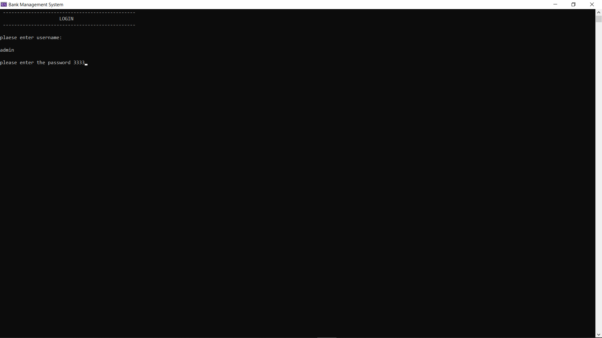
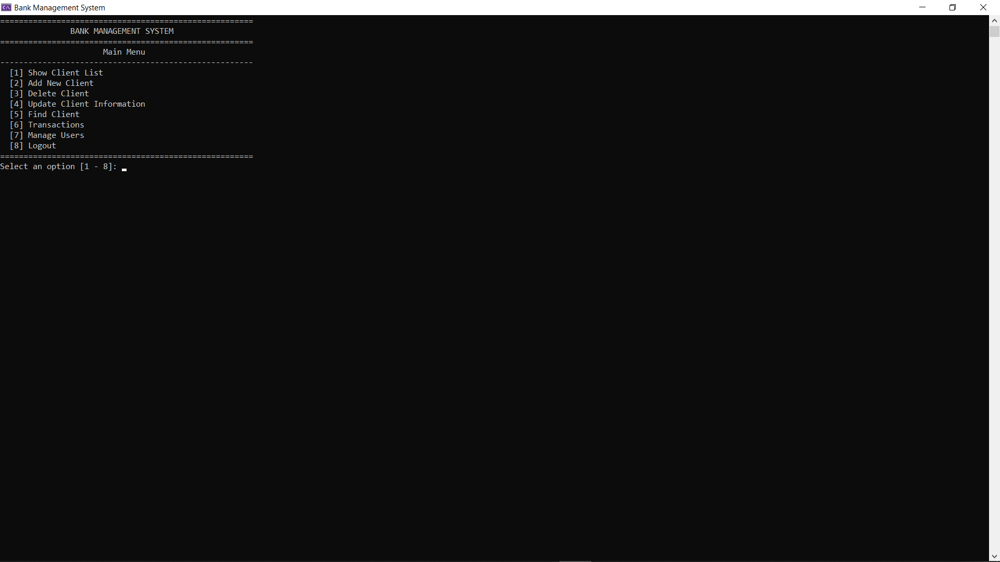
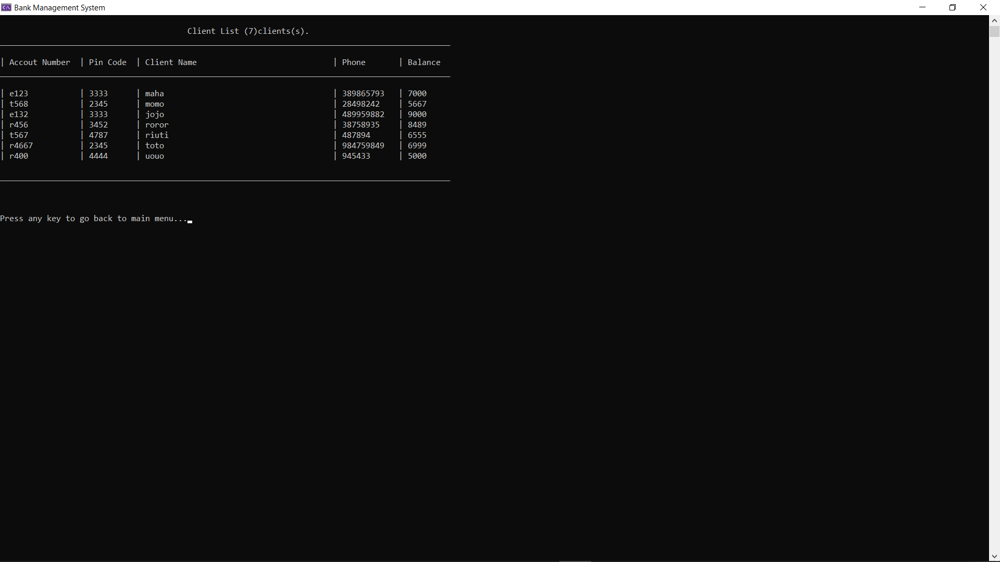
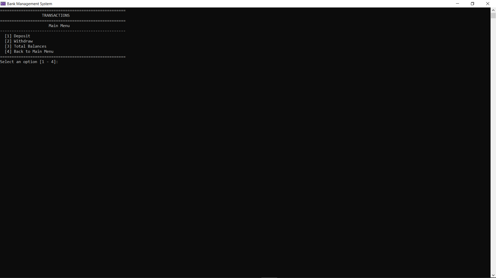
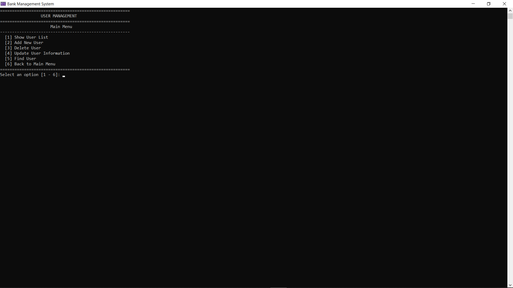

# 🏦 Bank Management System

> A console-based Bank Management System developed in **C++** with authentication, user management, client management, and banking transactions.

---

## ✨ Features

* Secure User Login
* Permission-Based Access Control
* Client Management (CRUD)
* User Management (CRUD)
* Deposit & Withdraw Transactions
* Total Balances Report
* File-Based Data Storage
* Console-Based User Interface

---

## 🛠️ Technologies Used

* C++
* Visual Studio
* STL (Vector, String, File Streams)
* File Handling
* Git & GitHub

---

## 📂 Project Structure

```
Bank-Management-System/
│
├── images/
│   ├── login-screen.png
│   ├── main-menu.png
│   ├── client-list.png
│   ├── transactions-menu.png
│   └── user-management-menu.png
│
├── BankManagementSystem.cpp
├── clients.txt
├── users.txt
├── README.md
└── .gitignore
```


## 📸 Screenshots

### Login Screen



---

### Main Menu



---

### Client List



---

### Transactions Menu



---

### User Management



---

## 🚀 How to Run

1. Clone the repository.
2. Open the project using Visual Studio.
3. Build the solution.
4. Run the application.
5. Make sure the required data files are located beside the executable.

---

## 📌 Project Status

**Version 1.0**

This project represents the procedural implementation of the Bank Management System developed during the programming course.

A future version will rebuild the entire application using **Object-Oriented Programming (OOP)** principles.

---
## Related Project

- [ATM System](https://github.com/mmoho92-cloud/ATM-System.git)

## 👨‍💻 Author

**Mohamed Almaho**
